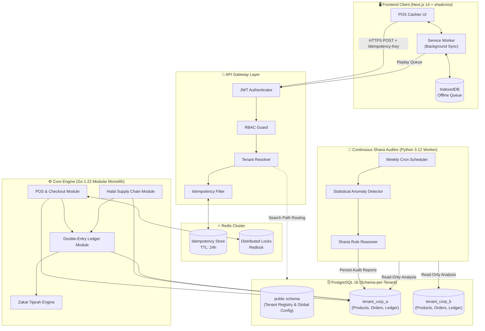

<div align="center">

# Tenet Commerce
### Multi-Tenant Enterprise POS & Halal Supply Chain Platform

[](LICENSE)
[](https://github.com/b45/tenet-commerce/releases/tag/v0.3.0)
[](https://go.dev/)
[](https://nextjs.org/)
[](https://www.postgresql.org/)
[](https://redis.io/)
[](docs/BENCHMARK_REPORT.md)
[](docs/ARCHITECTURE.md)
[](docs/SHARIA_COMPLIANCE.md)

<p align="center">
  <b>A cloud-native, offline-first enterprise retail engine converging multi-tenant POS, automated Halal certificate verification, double-entry Sharia ledgering, and continuous AI auditing.</b>
</p>

[Documentation](#-documentation-index) • [Key Features](#-key-features) • [System Architecture](#-system-architecture) • [Tech Stack](#-technology-stack) • [Quick Start](#-quick-start) • [Roadmap](#-roadmap)

---

</div>

## 📌 Overview

**Tenet Commerce** is an enterprise-grade retail platform engineered for high-throughput retail operations subject to strict **Sharia compliance and Halal regulatory standards**. 

Traditional enterprise POS systems treat supply chain compliance and financial ledgering as disconnected afterthoughts. Tenet Commerce natively bridges this gap through four tightly integrated core domains:

1. **High-Velocity Offline-First POS:** Empirically benchmarked at **1,096.3 RPS** (catalog read, 3.18ms median) and **123.7 TPS** (atomic checkouts with row-level locks, 61.25ms median), designed for offline resilience with client-side IndexedDB caching and background Service Worker synchronization.
2. **Deterministic Transaction Engine:** Redis-backed idempotency key verification (preventing double charges) coupled with dual-layer distributed inventory locking (`SELECT ... FOR UPDATE`).
3. **Halal Supply Chain Governance:** Automated hard-validation on Halal Certificate validity across Suppliers, Purchase Orders, Goods Receipts, and Stock Transfers.
4. **Sharia Financial Ledger & Applied AI:** Real-time double-entry journal, dynamic Zakat Tijarah (Trade Zakat) calculation, automated void/shrinkage reversals, and an asynchronous AI Reasoning Engine executing weekly continuous audits for financial anomalies.

---

## 🏛️ System Architecture

Tenet Commerce employs a **Modular Monolith** architecture with **Schema-per-Tenant Logical Isolation** in PostgreSQL. This ensures zero data leakage across enterprise tenants while maintaining minimal operational overhead.



---

## ✨ Key Features

| Domain | Capabilities |
|---|---|
| **POS & Checkout** | • Sub-second barcode/SKU lookup<br/>• Cash change calculation & payment reference tracking<br/>• Dynamic **Tenant QRIS** configuration via `store_settings`<br/>• **Atomic Void & Refund:** row locks, automatic restock, and Sharia reversal journal<br/>• Order history with multi-criteria filtering & Daily Sales Summary (X/Z-Report) |
| **Transaction Engine** | • Guaranteed idempotency via `Idempotency-Key` headers (TTL: 24h)<br/>• PostgreSQL `SELECT ... FOR UPDATE` row-level locking (Zero Overselling guaranteed)<br/>• Hardened 48-bit transaction numbering (281 trillion daily unique codes) |
| **Bakery & Retail Inventory** | • Complete Category and Product CRUD with soft-delete safety<br/>• Realistic seeded bakery catalog (Tarts, Breads, Pastries, Halal Snacks)<br/>• **Stock Opname & Spoilage Write-Off:** automated journals to `5020 Inventory Shrinkage & Loss` vs `1030 Merchandise Inventory`<br/>• Proactive low-stock replenishment alerts |
| **Halal Supply Chain** | • Supplier Halal Certificate tracking (MUI, BPJPH, JAKIM, etc.)<br/>• **Hard-block validation:** prevents PO, Goods Receipt, or transfers from expired certs<br/>• Complete traceability from PO to store shelf |
| **Sharia Ledger** | • Automated balanced double-entry journal for sales, voids, receipts, and shrinkage ($\sum \text{Debits} = \sum \text{Credits}$)<br/>• Real-time Trial Balance, Chart of Accounts, and Manager Business Dashboard<br/>• Dynamic **Zakat Tijarah** (2.5% Net Working Capital) calculation |
| **Continuous AI Auditor** | • Asynchronous Python worker running scheduled weekly audits<br/>• Heuristic anomaly detection (Benford's law, off-hours sales, round-number clustering)<br/>• Categorized severity alerts (`INFO`, `WARNING`, `CRITICAL`) |

---

## 💻 Technology Stack

```
tenet-commerce
├── Backend API      : Go 1.22+ (Chi / Gin Router, pgx, SQLC)
├── AI Worker        : Python 3.12+ (Pydantic, Polars, Scikit-learn)
├── Frontend UI      : Next.js 14 (App Router, TypeScript, Tailwind CSS, shadcn/ui)
├── Database         : PostgreSQL 16 (Schema-per-Tenant Isolation)
├── Cache & Locks    : Redis 7 (Idempotency Key Store & Distributed Locks)
├── Containerization : Docker & Docker Compose
└── CI/CD            : GitHub Actions (Lint, Test, Security Scan, Multi-arch Build)
```

---

## 📚 Documentation Index

Our documentation is structured for enterprise architects, security auditors, and developers:

- 📋 [**Product Requirements Document (PRD)**](docs/PRD.md): Executive summary, user stories, Gherkin acceptance criteria, and NFRs.
- 🏗️ [**Technical Architecture Deep-Dive**](docs/ARCHITECTURE.md): Multi-tenancy isolation, distributed locking, idempotency mechanics, and offline sync lifecycle.
- 🗄️ [**Database Schema & DDL Specification**](docs/DATABASE_SCHEMA.md): Complete PostgreSQL DDL, schema-per-tenant migration strategy, and double-entry ledger models.
- 🔌 [**REST API Specification**](docs/API_SPECIFICATION.md): Comprehensive endpoint contracts, request/response payloads, headers, and error dictionary.
- ⚡ [**Performance & Load Test Report (k6)**](docs/BENCHMARK_REPORT.md): High-concurrency benchmarks, throughput profiles (1,096 RPS read, 123.7 TPS write), P95/P99 latencies, and transaction entropy hardening.
- ⚖️ [**Sharia Compliance & AI Auditor**](docs/SHARIA_COMPLIANCE.md): Halal certification governance, Zakat Tijarah formula, and continuous audit heuristics.
- 🗺️ [**8-Week Implementation Roadmap**](docs/ROADMAP.md): Detailed sprint breakdowns, milestone deliverables, and risk mitigation strategies.
- 🤝 [**Contributing Guidelines**](docs/CONTRIBUTING.md): Engineering standards, branching models, conventional commits, and local setup.

---

## 🚀 Quick Start

### Prerequisites
- [Docker](https://docs.docker.com/get-docker/) (v24.0+)
- [Docker Compose](https://docs.docker.com/compose/) (v2.20+)
- [Go](https://go.dev/doc/install) (v1.22+) *(optional for local binary build)*
- [Node.js](https://nodejs.org/) (v20 LTS) *(optional for frontend development)*

### 1. Clone the Repository
```bash
git clone https://github.com/your-org/tenet-commerce.git
cd tenet-commerce
```

### 2. Configure Environment
```bash
cp .env.example .env
```

### 3. Launch Local Development Stack
```bash
docker compose up -d --build
```

### 4. Verify Services
- **Backend API Gateway:** [http://localhost:8080/healthz](http://localhost:8080/healthz)
- **POS Web Client:** [http://localhost:3000](http://localhost:3000)
- **PostgreSQL Database:** `localhost:5432` (`postgres` / `postgres`)
- **Redis Cache & Lock:** `localhost:6379`

---

## 🗺️ Roadmap & Sprint Progress

The MVP is structured as an **8-Week Fast-Track Sprint**:

- [x] **Phase 1: Foundation (Weeks 1-2):** Architecture, Multi-Tenant Postgres, JWT Auth, RBAC & Structured Logging (`v0.1.0`)
- [x] **Phase 2: Core Domain APIs & Extensions (Weeks 3-4):** POS Checkout Engine, Redis Idempotency, Halal Supply Chain Hard-Blocking, Double-Entry Ledger, Manager Dashboard, Retail Operations (Void, QRIS, Daily Summary), Bakery Inventory CRUD, and k6 Load Benchmarking (`v0.2.0` & `v0.3.0`)
- [ ] **Phase 3: Frontend Client & Offline-First POS (Weeks 5-6):** Next.js 14 POS Cashier Interface, IndexedDB Sync & Supply Chain Dashboards (`v0.4.0`)
- [ ] **Phase 4: Applied AI, Zakat Engine & Release (Weeks 7-8):** Python AI Auditor Worker, Zakat Tijarah Engine, and Production Docker Orchestration (`v0.5.0` & `v1.0.0`)

*See [docs/ROADMAP.md](docs/ROADMAP.md) for full phase details and milestone deliverables.*

---

## 🔒 Security & Data Privacy

- **Tenant Isolation:** Hard separation at the database layer via PostgreSQL schemas (`tenant_{uuid}`).
- **Data Protection:** All passwords hashed with `Argon2id`; JWT access tokens expire in 15 minutes.
- **Idempotent Safety:** Redis-guarded write operations guarantee zero double-charging or duplicate inventory decrements.

---

## 📄 License

This project is licensed under the **Apache License 2.0** - see the [LICENSE](LICENSE) file for details.
