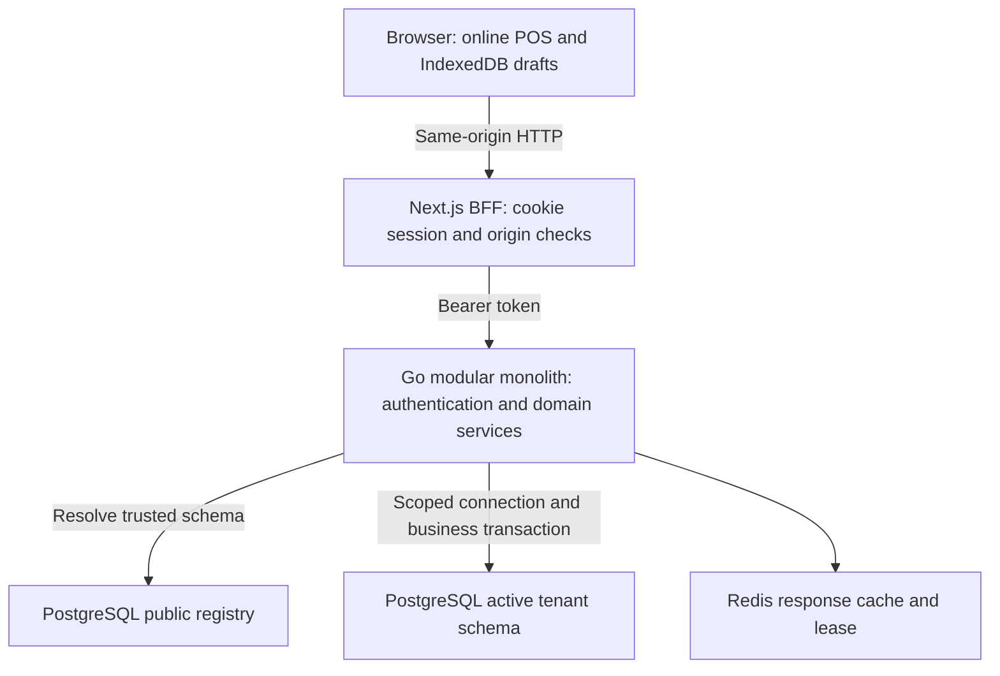
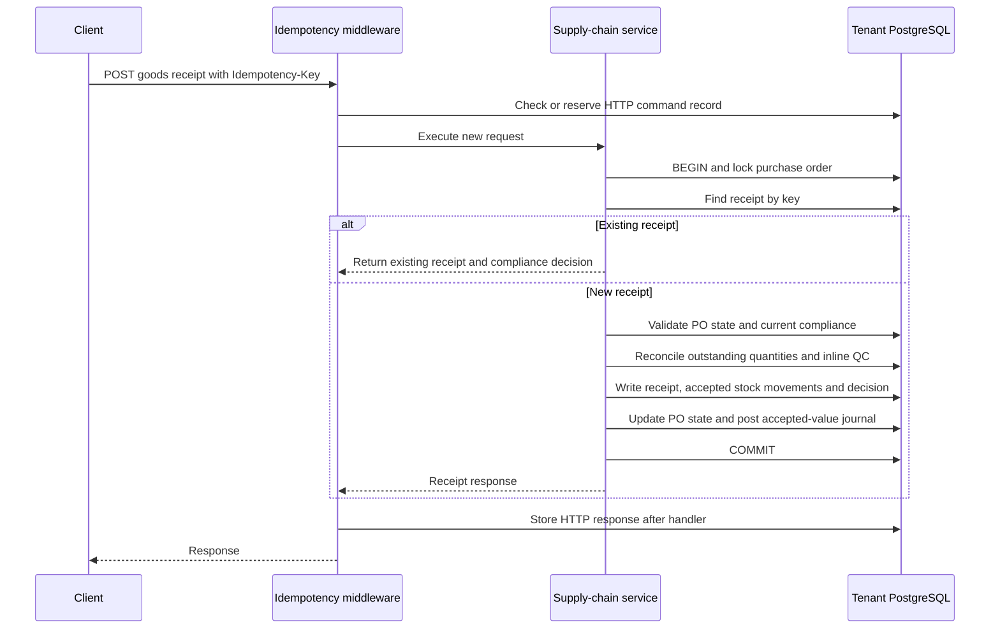
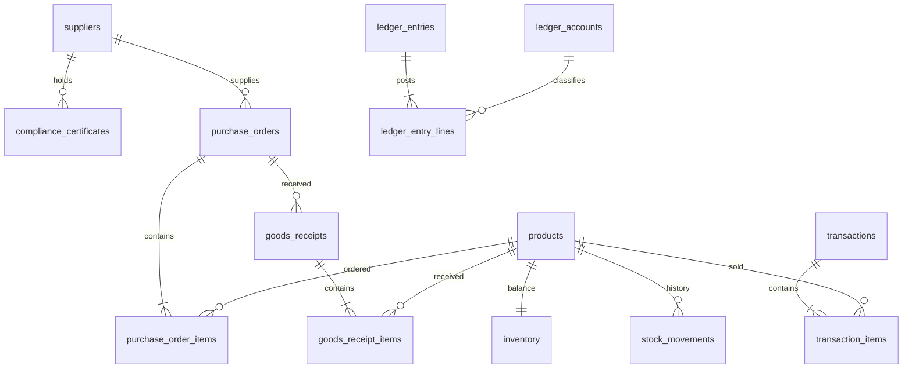

# Technical architecture

This describes the source audited at `203257aec9ca5c9e3211a22df548e4d266bee22a`. [Evidence and limitations](ARCHITECTURE_EVIDENCE.md) identifies code and tests; [implementation status](IMPLEMENTATION_STATUS.md) separates delivered scope from future work. The historical architecture remains available in Git history.

## Runtime topology and tenant boundary

The local Compose network does not provide TLS. Browser storage is a draft/catalog cache, not an offline payment ledger. The BFF is not the tenant authorization authority: the API validates identity and resolves the registry schema before domain access. Middleware sets the pooled connection search path; ScopedDB additionally offers transaction-local scoping. Connection release uses a defensive reset. Public registry access is deliberate; tenant domain access must use the resolved schema.

Source: [router](../backend/cmd/api/router.go), [tenant middleware](../backend/internal/tenant/middleware.go), [ScopedDB](../backend/internal/tenant/context.go), [Compose](../docker-compose.yml).

## Transaction and replay boundary

`POST /api/v1/pos/checkout` uses a business transaction for sale, items, inventory and journal. Product/stock row locks serialize conflicting writes. HTTP idempotency fingerprints method, concrete path and body; Redis caches responses while PostgreSQL stores durable HTTP records. The middleware response update happens after the handler completes, outside its transaction. Domain-specific lookup by key supports recovery, but that is not proof of atomic command/result storage for every mutation.

See [idempotency decision](adr/005-idempotency-recovery-boundary.md) and the [API specification](API_SPECIFICATION.md) for actual routes and errors. A timeout is an unknown outcome; clients must preserve the command identity rather than assume failure.

## Goods receipt sequence

Errors before business commit roll back that transaction. All-rejected receipts do not create accepted-stock valuation. The sequence shows the new-command path; cached replay can return before the service. Source: [service](../backend/internal/supplychain/service.go) and [repository](../backend/internal/supplychain/repository.go).

## Core tenant entities

This is a selected relationship view, not a complete schema or a guarantee that every minimum cardinality is enforced by a foreign key. Ledger source-document IDs provide application-level links to domain records. The canonical [bootstrap SQL](../scripts/init_dev_db.sql) and [database schema](DATABASE_SCHEMA.md) supply columns and constraints.

## Decisions and verification

- [Session strategy](adr/001-session-strategy.md)
- [Money representation](adr/002-money-representation.md)
- [Runtime operability](adr/003-runtime-operability-boundaries.md)
- [Tenant lifecycle](adr/004-tenant-lifecycle.md)
- [Idempotency recovery](adr/005-idempotency-recovery-boundary.md)
- [Inventory and inline QC](adr/006-inventory-qc-boundary.md)
- [Public evidence scope](adr/007-public-evidence-scope.md)

[CI](../.github/workflows/ci.yml) defines backend, frontend and browser jobs. Container builds and hosted availability need their own evidence. Structured request logs provide correlation; a managed observability deployment is not implied.

Run [read-only reconciliation](verification/README.md) only against the selected tenant. Diagram sources are the Mermaid blocks in this document and can be rendered by Mermaid-compatible Markdown viewers.

## Extension boundary

Offline cash replay needs price, stock, ownership and recovery policies in [Phase 3 design](FRONTEND_PHASE3_DESIGN.md). QRIS settings do not prove settlement. AI audit, Zakat calculation, dynamic audited maintenance control and production orchestration remain separate extensions. [Roadmap](ROADMAP.md) records broader goals; none is implied by this topology.
