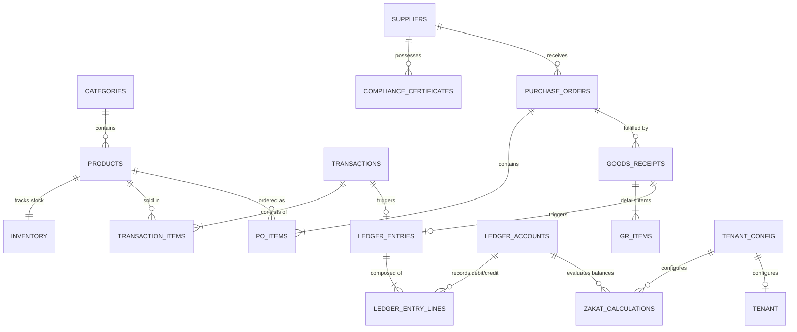

# Database Schema & Data Modeling Specification
## Tenet Commerce: PostgreSQL 16 Schema-per-Tenant Design

---

## 1. Schema Architecture Overview

Tenet Commerce utilizes a dual-tier PostgreSQL design:
1. **`public` Schema:** Global system orchestration, tenant provisioning registry, user authentication records, and system-wide audit logs.
2. **`tenant_{tenant_slug}` Schemas:** Completely isolated domain tables provisioned dynamically for each enterprise tenant upon registration.

---

## 2. Entity-Relationship Diagram (Tenant Schema)



---

## 3. Public Schema DDL (System Registry)

```sql
-- Create extension for UUID generation
CREATE EXTENSION IF NOT EXISTS "pgcrypto";

-- Global Tenant Registry
CREATE TABLE public.tenants (
    id UUID PRIMARY KEY DEFAULT gen_random_uuid(),
    slug VARCHAR(63) NOT NULL UNIQUE,
    company_name VARCHAR(255) NOT NULL,
    schema_name VARCHAR(63) NOT NULL UNIQUE,
    status VARCHAR(31) NOT NULL DEFAULT 'ACTIVE' CHECK (status IN ('ACTIVE', 'SUSPENDED', 'TERMINATED')),
    created_at TIMESTAMPTZ NOT NULL DEFAULT NOW(),
    updated_at TIMESTAMPTZ NOT NULL DEFAULT NOW()
);

-- Global Users & Authentication (Linked to Tenants)
CREATE TABLE public.users (
    id UUID PRIMARY KEY DEFAULT gen_random_uuid(),
    tenant_id UUID NOT NULL REFERENCES public.tenants(id) ON DELETE RESTRICT,
    email VARCHAR(255) NOT NULL UNIQUE,
    password_hash VARCHAR(255) NOT NULL,
    full_name VARCHAR(255) NOT NULL,
    role VARCHAR(63) NOT NULL CHECK (role IN ('CASHIER', 'MANAGER', 'COMPLIANCE_OFFICER', 'FINANCIAL_ADMIN', 'SUPER_ADMIN')),
    is_active BOOLEAN NOT NULL DEFAULT TRUE,
    created_at TIMESTAMPTZ NOT NULL DEFAULT NOW(),
    updated_at TIMESTAMPTZ NOT NULL DEFAULT NOW()
);

CREATE INDEX idx_users_tenant_email ON public.users(tenant_id, email);
```

---

## 4. Tenant Schema DDL (`tenant_{slug}`)

```sql
-- DDL executed inside each tenant schema

-- 4.0 Tenant Configuration
CREATE TABLE tenant_config (
    id UUID PRIMARY KEY DEFAULT gen_random_uuid(),
    config_key VARCHAR(127) NOT NULL UNIQUE,
    config_value JSONB NOT NULL,
    updated_at TIMESTAMPTZ NOT NULL DEFAULT NOW()
);

-- 4.1 Products & Categories
CREATE TABLE categories (
    id UUID PRIMARY KEY DEFAULT gen_random_uuid(),
    name VARCHAR(127) NOT NULL,
    code VARCHAR(31) NOT NULL UNIQUE,
    parent_id UUID REFERENCES categories(id) ON DELETE SET NULL,
    created_at TIMESTAMPTZ NOT NULL DEFAULT NOW()
);

CREATE TABLE products (
    id UUID PRIMARY KEY DEFAULT gen_random_uuid(),
    category_id UUID REFERENCES categories(id) ON DELETE RESTRICT,
    sku VARCHAR(63) NOT NULL UNIQUE,
    barcode VARCHAR(127) UNIQUE,
    name VARCHAR(255) NOT NULL,
    description TEXT,
    unit_price NUMERIC(15, 2) NOT NULL CHECK (unit_price >= 0),
    cost_price NUMERIC(15, 2) NOT NULL CHECK (cost_price >= 0),
    compliance_tags JSONB,
    is_active BOOLEAN NOT NULL DEFAULT TRUE,
    created_at TIMESTAMPTZ NOT NULL DEFAULT NOW(),
    updated_at TIMESTAMPTZ NOT NULL DEFAULT NOW()
);

CREATE TABLE inventory (
    product_id UUID PRIMARY KEY REFERENCES products(id) ON DELETE CASCADE,
    stock_quantity INTEGER NOT NULL DEFAULT 0 CHECK (stock_quantity >= 0),
    reorder_threshold INTEGER NOT NULL DEFAULT 10,
    warehouse_location VARCHAR(127) DEFAULT 'MAIN_STORE',
    updated_at TIMESTAMPTZ NOT NULL DEFAULT NOW()
);

-- 4.2 Point of Sale & Transactions
CREATE TABLE transactions (
    id UUID PRIMARY KEY DEFAULT gen_random_uuid(),
    transaction_number VARCHAR(63) NOT NULL UNIQUE,
    idempotency_key VARCHAR(127) NOT NULL UNIQUE,
    cashier_id UUID NOT NULL,
    subtotal_amount NUMERIC(15, 2) NOT NULL CHECK (subtotal_amount >= 0),
    tax_amount NUMERIC(15, 2) NOT NULL DEFAULT 0 CHECK (tax_amount >= 0),
    discount_amount NUMERIC(15, 2) NOT NULL DEFAULT 0 CHECK (discount_amount >= 0),
    total_amount NUMERIC(15, 2) NOT NULL CHECK (total_amount >= 0),
    payment_method VARCHAR(31) NOT NULL CHECK (payment_method IN ('CASH', 'SIMULATED_CARD', 'QRIS')),
    status VARCHAR(31) NOT NULL DEFAULT 'COMPLETED' CHECK (status IN ('PENDING', 'COMPLETED', 'VOIDED')),
    customer_name VARCHAR(127),
    notes TEXT,
    cash_tendered NUMERIC(15, 2) DEFAULT 0,
    change_amount NUMERIC(15, 2) DEFAULT 0,
    payment_reference VARCHAR(127),
    void_reason VARCHAR(255),
    voided_at TIMESTAMPTZ,
    voided_by UUID,
    created_at TIMESTAMPTZ NOT NULL DEFAULT NOW()
);

CREATE TABLE transaction_items (
    id UUID PRIMARY KEY DEFAULT gen_random_uuid(),
    transaction_id UUID NOT NULL REFERENCES transactions(id) ON DELETE CASCADE,
    product_id UUID NOT NULL REFERENCES products(id) ON DELETE RESTRICT,
    quantity INTEGER NOT NULL CHECK (quantity > 0),
    unit_price NUMERIC(15, 2) NOT NULL CHECK (unit_price >= 0),
    cost_price NUMERIC(15, 2) NOT NULL CHECK (cost_price >= 0),
    subtotal NUMERIC(15, 2) NOT NULL CHECK (subtotal >= 0)
);

CREATE TABLE store_settings (
    key VARCHAR(63) PRIMARY KEY,
    value JSONB NOT NULL,
    updated_at TIMESTAMPTZ NOT NULL DEFAULT NOW()
);

CREATE TABLE inventory_adjustments (
    id UUID PRIMARY KEY DEFAULT gen_random_uuid(),
    product_id UUID NOT NULL REFERENCES products(id) ON DELETE CASCADE,
    adjustment_type VARCHAR(31) NOT NULL CHECK (adjustment_type IN ('ADD', 'SUBTRACT', 'SET')),
    quantity_delta INTEGER NOT NULL,
    previous_quantity INTEGER NOT NULL,
    new_quantity INTEGER NOT NULL,
    reason VARCHAR(63) NOT NULL CHECK (reason IN ('DAMAGE', 'EXPIRED', 'AUDIT_CORRECTION', 'RESTOCK', 'OTHER')),
    notes TEXT,
    adjusted_by UUID NOT NULL,
    ledger_entry_id UUID,
    created_at TIMESTAMPTZ NOT NULL DEFAULT NOW()
);

CREATE INDEX idx_transactions_created_at ON transactions(created_at DESC);
CREATE INDEX idx_transactions_idempotency ON transactions(idempotency_key);
CREATE INDEX idx_transactions_status ON transactions(status);
CREATE INDEX idx_transactions_payment ON transactions(payment_method);
CREATE INDEX idx_inventory_adjustments_product ON inventory_adjustments(product_id);
CREATE INDEX idx_inventory_adjustments_created ON inventory_adjustments(created_at DESC);

-- 4.3 Compliance-Aware Supply Chain Management
CREATE TABLE suppliers (
    id UUID PRIMARY KEY DEFAULT gen_random_uuid(),
    code VARCHAR(63) NOT NULL UNIQUE,
    company_name VARCHAR(255) NOT NULL,
    contact_person VARCHAR(127),
    contact_email VARCHAR(255),
    contact_phone VARCHAR(63),
    is_active BOOLEAN NOT NULL DEFAULT TRUE,
    created_at TIMESTAMPTZ NOT NULL DEFAULT NOW()
);

CREATE TABLE compliance_certificates (
    id UUID PRIMARY KEY DEFAULT gen_random_uuid(),
    supplier_id UUID NOT NULL REFERENCES suppliers(id) ON DELETE RESTRICT,
    cert_type VARCHAR(63) NOT NULL, -- e.g. HALAL_MUI, BPOM, ORGANIC
    certificate_number VARCHAR(127) NOT NULL UNIQUE,
    issuing_authority VARCHAR(127) NOT NULL, -- e.g. BPJPH, MUI, BPOM RI
    scope TEXT NOT NULL,
    valid_from DATE NOT NULL,
    expiry_date DATE NOT NULL,
    document_url VARCHAR(511),
    created_at TIMESTAMPTZ NOT NULL DEFAULT NOW()
);

CREATE INDEX idx_compliance_cert_expiry ON compliance_certificates(expiry_date);

CREATE TABLE purchase_orders (
    id UUID PRIMARY KEY DEFAULT gen_random_uuid(),
    po_number VARCHAR(63) NOT NULL UNIQUE,
    supplier_id UUID NOT NULL REFERENCES suppliers(id) ON DELETE RESTRICT,
    compliance_cert_id UUID REFERENCES compliance_certificates(id) ON DELETE RESTRICT,
    total_amount NUMERIC(15, 2) NOT NULL CHECK (total_amount >= 0),
    status VARCHAR(31) NOT NULL DEFAULT 'DRAFT' CHECK (status IN ('DRAFT', 'ISSUED', 'PARTIALLY_RECEIVED', 'RECEIVED', 'CANCELLED')),
    issued_date DATE NOT NULL DEFAULT CURRENT_DATE,
    created_at TIMESTAMPTZ NOT NULL DEFAULT NOW()
);

CREATE TABLE purchase_order_items (
    id UUID PRIMARY KEY DEFAULT gen_random_uuid(),
    purchase_order_id UUID NOT NULL REFERENCES purchase_orders(id) ON DELETE CASCADE,
    product_id UUID NOT NULL REFERENCES products(id) ON DELETE RESTRICT,
    quantity INTEGER NOT NULL CHECK (quantity > 0),
    unit_cost NUMERIC(15, 2) NOT NULL CHECK (unit_cost >= 0),
    subtotal NUMERIC(15, 2) NOT NULL CHECK (subtotal >= 0)
);

CREATE TABLE goods_receipts (
    id UUID PRIMARY KEY DEFAULT gen_random_uuid(),
    gr_number VARCHAR(63) NOT NULL UNIQUE,
    idempotency_key VARCHAR(255) NOT NULL UNIQUE,
    purchase_order_id UUID NOT NULL REFERENCES purchase_orders(id) ON DELETE RESTRICT,
    received_by UUID NOT NULL,
    received_date DATE NOT NULL DEFAULT CURRENT_DATE,
    notes TEXT,
    created_at TIMESTAMPTZ NOT NULL DEFAULT NOW()
);

CREATE TABLE goods_receipt_items (
    id UUID PRIMARY KEY DEFAULT gen_random_uuid(),
    goods_receipt_id UUID NOT NULL REFERENCES goods_receipts(id) ON DELETE CASCADE,
    product_id UUID NOT NULL REFERENCES products(id) ON DELETE RESTRICT,
    received_quantity INTEGER NOT NULL CHECK (received_quantity >= 0)
);

-- 4.4 Sharia Double-Entry General Ledger
CREATE TABLE ledger_accounts (
    id UUID PRIMARY KEY DEFAULT gen_random_uuid(),
    code VARCHAR(31) NOT NULL UNIQUE, -- e.g. 1010, 1030, 2010, 4010, 5010
    name VARCHAR(127) NOT NULL,
    account_type VARCHAR(31) NOT NULL CHECK (account_type IN ('ASSET', 'LIABILITY', 'EQUITY', 'REVENUE', 'EXPENSE')),
    is_zakat_eligible BOOLEAN NOT NULL DEFAULT FALSE,
    is_active BOOLEAN NOT NULL DEFAULT TRUE,
    created_at TIMESTAMPTZ NOT NULL DEFAULT NOW()
);

CREATE TABLE ledger_entries (
    id UUID PRIMARY KEY DEFAULT gen_random_uuid(),
    entry_number VARCHAR(63) NOT NULL UNIQUE,
    entry_date DATE NOT NULL DEFAULT CURRENT_DATE,
    source_document_type VARCHAR(63) NOT NULL CHECK (source_document_type IN ('POS_SALE', 'POS_VOID', 'GOODS_RECEIPT', 'MANUAL_ADJUSTMENT', 'ZAKAT_DISBURSEMENT')),
    source_document_id UUID,
    memo TEXT NOT NULL,
    created_at TIMESTAMPTZ NOT NULL DEFAULT NOW()
);

CREATE TABLE ledger_entry_lines (
    id UUID PRIMARY KEY DEFAULT gen_random_uuid(),
    ledger_entry_id UUID NOT NULL REFERENCES ledger_entries(id) ON DELETE CASCADE,
    account_id UUID NOT NULL REFERENCES ledger_accounts(id) ON DELETE RESTRICT,
    debit_amount NUMERIC(15, 2) NOT NULL DEFAULT 0 CHECK (debit_amount >= 0),
    credit_amount NUMERIC(15, 2) NOT NULL DEFAULT 0 CHECK (credit_amount >= 0),
    CONSTRAINT chk_debit_or_credit CHECK (
        (debit_amount > 0 AND credit_amount = 0) OR 
        (credit_amount > 0 AND debit_amount = 0)
    )
);

CREATE INDEX idx_ledger_lines_account ON ledger_entry_lines(account_id);
CREATE INDEX idx_ledger_entries_date ON ledger_entries(entry_date);

-- 4.5 Zakat Tijarah Calculations
CREATE TABLE zakat_calculations (
    id UUID PRIMARY KEY DEFAULT gen_random_uuid(),
    calculation_date DATE NOT NULL DEFAULT CURRENT_DATE,
    nisab_gold_price_per_gram NUMERIC(15, 2) NOT NULL,
    nisab_threshold_value NUMERIC(15, 2) NOT NULL, -- 85 grams of gold equivalent
    cash_and_bank_balance NUMERIC(15, 2) NOT NULL,
    net_receivables_balance NUMERIC(15, 2) NOT NULL,
    inventory_valuation_balance NUMERIC(15, 2) NOT NULL,
    current_liabilities_balance NUMERIC(15, 2) NOT NULL,
    zakat_base_amount NUMERIC(15, 2) NOT NULL,
    zakat_rate NUMERIC(5, 4) NOT NULL DEFAULT 0.0250, -- 2.5%
    zakat_due_amount NUMERIC(15, 2) NOT NULL,
    is_nisab_met BOOLEAN NOT NULL,
    created_at TIMESTAMPTZ NOT NULL DEFAULT NOW()
);

-- 4.6 Continuous AI Auditor Reports
CREATE TABLE ai_audit_reports (
    id UUID PRIMARY KEY DEFAULT gen_random_uuid(),
    report_code VARCHAR(63) NOT NULL UNIQUE,
    audit_period_start DATE NOT NULL,
    audit_period_end DATE NOT NULL,
    severity VARCHAR(31) NOT NULL CHECK (severity IN ('INFO', 'WARNING', 'CRITICAL')),
    total_transactions_scanned INTEGER NOT NULL,
    total_anomalies_detected INTEGER NOT NULL,
    anomaly_summary JSONB NOT NULL,
    recommended_actions JSONB NOT NULL,
    created_at TIMESTAMPTZ NOT NULL DEFAULT NOW()
);
```

---

## 5. Ledger Balance Invariant Trigger

To guarantee that no unbalanced journal entry can ever be committed to the database, a PostgreSQL constraint trigger executes at the transaction commit level:

```sql
CREATE OR REPLACE FUNCTION verify_ledger_entry_balance()
RETURNS TRIGGER AS $$
DECLARE
    total_debit NUMERIC(15, 2);
    total_credit NUMERIC(15, 2);
BEGIN
    SELECT COALESCE(SUM(debit_amount), 0), COALESCE(SUM(credit_amount), 0)
    INTO total_debit, total_credit
    FROM ledger_entry_lines
    WHERE ledger_entry_id = NEW.ledger_entry_id;

    IF total_debit <> total_credit THEN
        RAISE EXCEPTION 'Sharia Ledger Invariant Violation: Total Debits (%) must equal Total Credits (%) for Entry %', 
            total_debit, total_credit, NEW.ledger_entry_id;
    END IF;

    RETURN NEW;
END;
$$ LANGUAGE plpgsql;

CREATE CONSTRAINT TRIGGER trg_verify_ledger_balance
AFTER INSERT OR UPDATE ON ledger_entry_lines
DEFERRABLE INITIALLY DEFERRED
FOR EACH ROW
EXECUTE FUNCTION verify_ledger_entry_balance();
```

---

*Tenet Commerce — Database Schema & DDL Specification v1.0.0*
