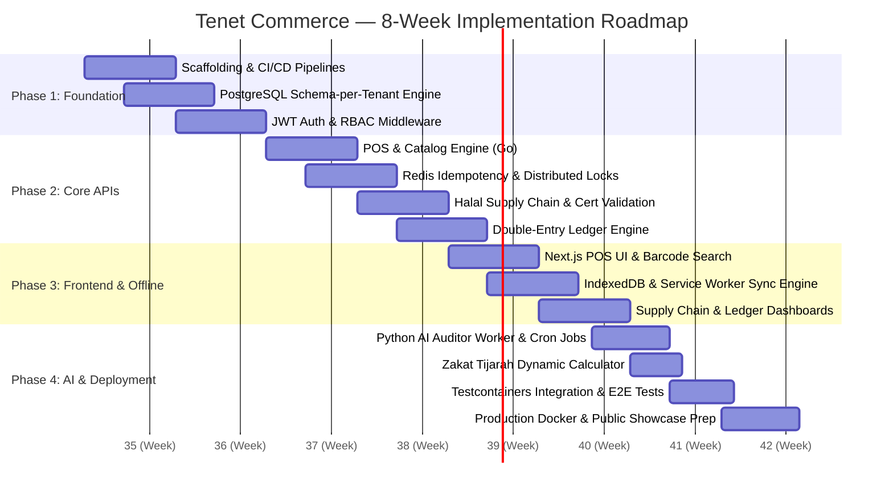

# 8-Week Implementation Plan & Engineering Roadmap
## Tenet Commerce: Enterprise Fast-Track MVP Sprint

---

## 1. Master Sprint Schedule & Phases

---

## 2. Phase-by-Phase Work Breakdown Structure (WBS)

### Phase 1: Foundation & Core Infrastructure (Weeks 1 – 2)
- **Objective:** Establish the development environment, database multi-tenancy engine, CI/CD pipeline, authentication guards, and observability foundation.
- **Key Deliverables:**
  - [x] Monorepo structure (`backend/`, `frontend/`, `ai-worker/`, `docs/`).
  - [x] GitHub Actions CI pipeline for linting, security scanning, and multi-architecture Docker image builds.
  - [x] PostgreSQL dynamic `search_path` connection pool middleware for Schema-per-Tenant routing.
  - [x] JWT token lifecycle (access/refresh token issuance, verification, tenant context injection).
  - [x] RBAC permission guards protecting endpoint routes (`RequireRole`, `RequirePermission`).
  - [x] Standardized API response envelopes (`pkg/response`).
  - [x] Structured JSON Logging (`pkg/logger` with `log/slog`), Request Tracing (`X-Trace-ID`, `X-Span-ID`), Real IP resolution, and Loki/Promtail compatibility.

---

### Phase 2: Core Domain APIs & Transaction Engine (Weeks 3 – 4)
- **Objective:** Implement the transactional backend in Go with strict concurrency controls and Sharia compliance rules.
- **Key Deliverables:**
  - [x] **POS Catalog & Checkout API:** `GET /api/v1/pos/products` and `POST /api/v1/pos/checkout` with atomic inventory decrements.
  - [x] **Redis Idempotency Layer:** `Idempotency-Key` interceptor preventing duplicate submissions (`pkg/redis`).
  - [x] **Concurrency Stock Locking:** Database transaction (`pgx.Tx`) with row-level locks (`SELECT ... FOR UPDATE OF p, i`).
  - [ ] **Halal Supply Chain Module:** Supplier registry, Halal Certificate tracking, and **hard-validation interceptor** blocking invalid POs and Goods Receipts.
  - [ ] **Double-Entry Ledger Engine:** Automated journal generation adhering to $\sum \text{Debits} = \sum \text{Credits}$ balance invariants.

---

### Phase 3: Frontend Client & Offline-First POS (Weeks 5 – 6)
- **Objective:** Build a responsive, high-performance web POS using Next.js 14 and shadcn/ui with offline resilience.
- **Key Deliverables:**
  - [ ] **High-Velocity POS Cashier Interface:** Barcode scanner listener, rapid cart manipulation, and discount overrides.
  - [ ] **Offline Storage & Queuing:** Browser `IndexedDB` persistence of products and offline transaction records.
  - [ ] **Background Sync Engine:** Service Worker detecting network state transitions and deterministically replaying queued transactions.
  - [ ] **Enterprise Dashboards:** Supply Chain management UI (PO, GR) and Sharia Ledger reporting (Chart of Accounts, Trial Balance).

---

### Phase 4: Applied AI, Zakat Engine & Production Release (Weeks 7 – 8)
- **Objective:** Deploy the continuous AI auditor, finalize real-time Zakat calculation, and run end-to-end quality assurance.
- **Key Deliverables:**
  - [ ] **AI Continuous Auditor (Python 3.12):** Scheduled batch analysis executing Benford's Law tests, off-hours sales outlier detection, and report generation.
  - [ ] **Zakat Tijarah Engine:** Real-time calculation of Net Working Capital Zakat with dynamic gold spot price inputs.
  - [ ] **Automated Test Suite:** Full integration coverage using Testcontainers (PostgreSQL + Redis) and Playwright E2E smoke tests.
  - [ ] **Container Deployment:** Multi-stage production Docker configurations and Docker Compose orchestrations.

---

## 3. Technical Risk Management Matrix

| Risk | Probability | Impact | Mitigation Strategy |
|---|:---:|:---:|---|
| **Inventory Overselling during Flash Sales** | Medium | High | Dual-layer concurrency: Redis distributed lock handles fast-path rate limiting; DB `SELECT ... FOR UPDATE` guarantees ACID consistency. |
| **Double Charges on Offline Network Reconnect** | High | High | Client-generated UUIDv4 `Idempotency-Key` persisted in IndexedDB and validated via Redis `SETNX` before transaction execution. |
| **Tenant Data Leakage in Monolith** | Low | Critical | Automated middleware sets `SET search_path TO tenant_{uuid}` on every database connection before handler execution. |
| **Expired Halal Goods Entering Warehouse** | Low | Critical | Hard-block validation triggered on both Purchase Order creation and physical Goods Receipt confirmation. |

---

*Tenet Commerce — Implementation Roadmap v1.0.0*
