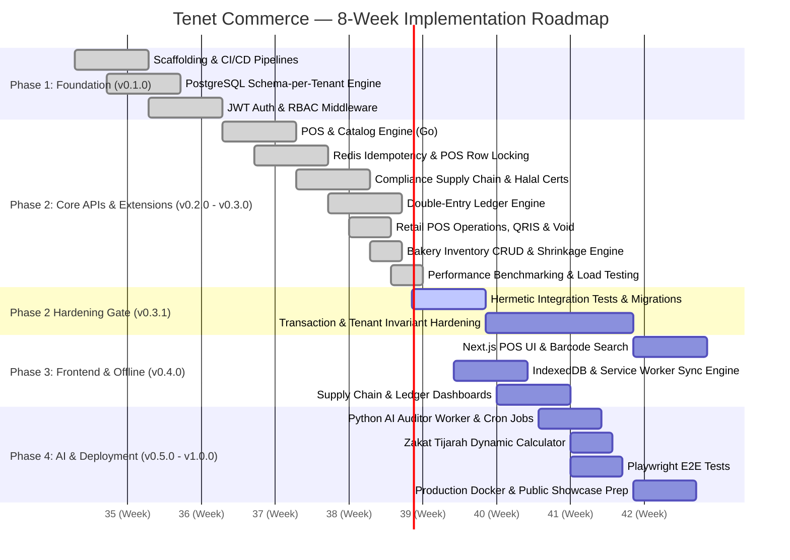

# 8-Week Implementation Plan & Engineering Roadmap
## Tenet Commerce: Enterprise Fast-Track MVP Sprint

---

## 1. Master Sprint Schedule & Phases

---

## 2. Phase-by-Phase Work Breakdown Structure (WBS)

### Phase 1: Foundation & Core Infrastructure (Weeks 1 – 2)
- **Objective:** Establish the development environment, database multi-tenancy engine, CI/CD pipeline, authentication guards, and observability foundation.
- **Key Deliverables:**
  - [x] Monorepo structure (`backend/`, `frontend/`, `ai-worker/`, `docs/`).
  - [x] GitHub Actions CI pipeline for Go build/vet/test and frontend lint/build.
  - [x] PostgreSQL dynamic `search_path` connection pool middleware for Schema-per-Tenant routing.
  - [x] JWT token lifecycle (access/refresh token issuance, verification, tenant context injection).
  - [x] RBAC permission guards protecting endpoint routes (`RequireRole`, `RequirePermission`).
  - [x] Standardized API response envelopes (`pkg/response`).
  - [x] Structured JSON Logging (`pkg/logger` with `log/slog`), Request Tracing (`X-Trace-ID`, `X-Span-ID`), Real IP resolution, and Loki/Promtail compatibility.

---

### Phase 2: Core Domain APIs & Transaction Engine (Weeks 3 – 4)
- **Objective:** Implement the transactional backend in Go with strict concurrency controls, retail operational workflows, and Sharia compliance rules.
- **Key Deliverables:**
  - [x] **POS Catalog & Checkout API:** `GET /api/v1/pos/products` and `POST /api/v1/pos/checkout` with atomic inventory decrements and cash change calculations.
  - [x] **Order History & Detail API:** `GET /api/v1/pos/orders` with multi-criteria filtering (status, date range, pagination) and line-item breakdown (`GET /api/v1/pos/orders/:id`).
  - [x] **Atomic POS Void & Refund Reversal:** `POST /api/v1/pos/orders/:id/void` with row locks, stock restoration, and automated double-entry reversal journal (`SourceDocPOSVoid`).
  - [x] **End-of-Day Daily Summary (X/Z Report):** `GET /api/v1/pos/daily-summary` providing gross/net sales, COGS, gross margins, and payment method breakdowns.
  - [x] **Tenant QRIS Integration:** Dynamic QRIS merchant configuration (`GET`/`PUT /api/v1/pos/qris`) and simulated digital payments.
  - [x] **Bakery / Retail Inventory Management API:** Full Category and Product CRUD (`GET`, `POST`, `PUT`, `DELETE`) with soft-delete support.
  - [x] **Stock Opname & Spoilage Write-Off Engine:** `POST /api/v1/pos/inventory/adjust` with audit trail and automated Sharia shrinkage journals (`5020 Inventory Shrinkage & Loss` $\leftrightarrow$ `1030 Merchandise Inventory`).
  - [x] **Low-Stock Replenishment Alerts:** `GET /api/v1/pos/inventory/low-stock` for proactive baking/purchasing triggers.
  - [x] **Redis Idempotency Layer (partial):** `Idempotency-Key` middleware on POS checkout, void, and stock adjustment.
  - [x] **Concurrency Stock Locking:** Database transaction (`pgx.Tx`) with row-level locks (`SELECT ... FOR UPDATE OF p, i`).
  - [x] **Compliance-Aware Supply Chain Module:** Supplier registry, Compliance Certificate tracking, and **configurable hard-validation interceptor** blocking invalid POs and Goods Receipts.
  - [x] **Double-Entry Ledger Engine:** Automated journal generation adhering to $\sum \text{Debits} = \sum \text{Credits}$ balance invariants.

---

### Phase 2 Hardening Gate (v0.3.1)
- **Objective:** Prove Phase 1–2 invariants before expanding the product surface in Phase 3.
- **Exit criteria:** Hermetic PostgreSQL/Redis integration tests; transaction-scoped tenant context; durable idempotency; atomic PO/GR reconciliation; exact-money and append-only-ledger decisions; synchronized API/benchmark evidence.
- **Status:** Active. Phase 3 is intentionally on hold until this gate is passed.

### Phase 3: Frontend Client & Offline-First POS
- **Objective:** Build a responsive, high-performance web POS using Next.js 14 and shadcn/ui with offline resilience.
- **Key Deliverables:**
  - [ ] **High-Velocity POS Cashier Interface:** Barcode scanner listener, rapid cart manipulation, and discount overrides.
  - [ ] **Offline Storage & Queuing:** Browser `IndexedDB` persistence of products and offline transaction records.
  - [ ] **Background Sync Engine:** Service Worker detecting network state transitions and deterministically replaying queued transactions.
  - [ ] **Enterprise Dashboards:** Supply Chain management UI (PO, GR) and Sharia Ledger reporting (Chart of Accounts, Trial Balance).

---

### Phase 4: Applied AI, Zakat Engine & Production Release (Weeks 7 – 8)
- **Objective:** Deploy the continuous AI auditor, finalize real-time Zakat calculation, and run end-to-end quality assurance.
- **Key Deliverables:**
  - [ ] **AI Continuous Auditor (Python 3.12):** Scheduled batch analysis executing Benford's Law tests, off-hours sales outlier detection, and report generation.
  - [ ] **Zakat Tijarah Engine:** Real-time calculation of Net Working Capital Zakat with dynamic gold spot price inputs.
  - [ ] **End-to-End Test Suite:** Playwright smoke tests after the Phase 3 client exists. PostgreSQL/Redis integration coverage belongs to the Phase 2 hardening gate.
  - [ ] **Container Deployment:** Multi-stage production Docker configurations and Docker Compose orchestrations.

---

## 3. Technical Risk Management Matrix

| Risk | Probability | Impact | Mitigation Strategy |
|---|:---:|:---:|---|
| **Inventory Overselling during Flash Sales** | Medium | High | Checkout uses PostgreSQL row locking. Concurrent mutation tests are a Phase 2 hardening requirement. |
| **Double Charges on Offline Network Reconnect** | High | High | Current Redis idempotency is limited to selected POS mutations; durable idempotency is required before offline replay is introduced. |
| **Tenant Data Leakage in Monolith** | Low | Critical | Current middleware sets a trusted search path on a request-scoped connection. Transaction-scoped pool isolation is a hardening requirement. |
| **Expired Compliance Goods Entering Warehouse** | Low | Critical | Hard-block validation triggered conditionally based on tenant configuration on both Purchase Order creation and physical Goods Receipt confirmation. |

---

*Tenet Commerce — Implementation Roadmap v1.0.0*
