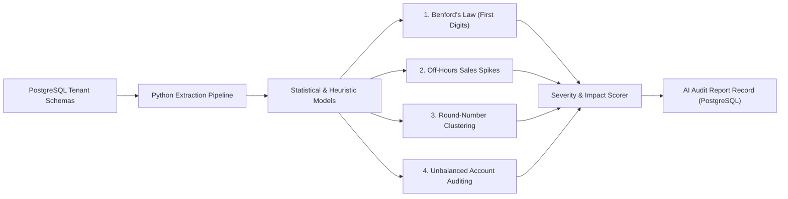

# Sharia Compliance, Zakat Engine & AI Auditor Specification
## Tenet Commerce: Islamic Fintech Governance Framework

---

## 1. Executive Summary & Sharia Governance Model

Tenet Commerce embeds Islamic Financial Jurisprudence (*Fiqh al-Mu'amalat*) directly into the application's transaction layer, supply chain pipeline, and general ledger. The platform complies with standard benchmarks set by the **Accounting and Auditing Organization for Islamic Financial Institutions (AAOIFI)** and national Halal regulatory authorities (e.g., **BPJPH / MUI Indonesia**, **JAKIM Malaysia**, **MUIS Singapore**).

```
┌────────────────────────────────────────────────────────────────────────────────────────┐
│                          SHARIA COMPLIANCE GOVERNANCE PILLARS                          │
├──────────────────────────────┬──────────────────────────────┬──────────────────────────┤
│ 1. Halal Supply Chain        │ 2. Sharia Financial Ledger   │ 3. Continuous AI Auditor │
│                              │                              │                          │
│ • Zero-tolerance hard-block  │ • Strict double-entry rules  │ • Benford's Law analysis │
│ • Regulatory authority check │ • Real-time Zakat Tijarah    │ • Off-hours txn anomaly  │
│ • Expiration countdown alerts│ • Nisab dynamic evaluation   │ • Unbalanced journal flag│
└──────────────────────────────┴──────────────────────────────┴──────────────────────────┘
```

---

## 2. Halal Supply Chain Verification Engine

### 2.1 Supported Regulatory Authorities
The system maintains cryptographic and structured records of Halal Certificates recognized by international bodies:
- **BPJPH** (Badan Penyelenggara Jaminan Produk Halal - Indonesia)
- **MUI** (Majelis Ulama Indonesia)
- **JAKIM** (Department of Islamic Development Malaysia)
- **MUIS** (Majlis Ugama Islam Singapura)
- **CICOT** (The Central Islamic Committee of Thailand)

### 2.2 Hard-Validation Rules & Transaction Interceptors

To maintain Halal integrity throughout procurement, the business logic layer enforces immutable validation triggers:

```
[ Purchase Order Creation ]
          │
          ▼
   Is Supplier Halal Cert Valid?
          │
    ┌─────┴─────┐
    ▼           ▼
  [YES]        [NO] (Expired or Missing)
    │           │
    │           ▼
    │     HTTP 422: HALAL_CERT_EXPIRED
    │     Log compliance security incident
    │     ABORT OPERATION
    │
    ▼
[ Goods Receipt & Inward Stock ]
          │
          ▼
   Re-validate Expiry on GR Date
          │
    ┌─────┴─────┐
    ▼           ▼
  [YES]        [NO] (Expired during transit)
    │           │
    │           ▼
    │     Quarantine goods to NON_HALAL_HOLD
    │     Reject ledger inventory capitalization
    │
    ▼
[ Update Inventory & Post Journal ]
```

---

## 3. Zakat Tijarah (Trade Zakat) Calculation Methodology

### 3.1 Accounting Methodology (AAOIFI Standard No. 35)

Tenet Commerce implements the **Net Working Capital Approach** (*Nazarat al-Amwal al-Zahirah*) recommended by AAOIFI and national zakat boards (e.g., BAZNAS):

$$\text{Zakat Base} = \left( \text{Cash \& Bank} + \text{Trade Receivables} + \text{Merchandise Inventory} \right) - \left( \text{Short-Term Operating Liabilities} \right)$$

$$\text{Zakat Liability} = \begin{cases} 
\text{Zakat Base} \times 2.50\%, & \text{if } \text{Zakat Base} \ge \text{Nisab} \text{ (Solar Year)} \\
0, & \text{if } \text{Zakat Base} < \text{Nisab}
\end{cases}$$

### 3.2 Dynamic Nisab Evaluation
- **Nisab Benchmark:** The cash equivalent of **85 grams of pure gold (24 Karat)**.
- **Dynamic Valuation:** The engine accepts daily gold spot prices to compute the live threshold:
  $$\text{Nisab Threshold} = 85 \times \text{Spot Price of Gold (per gram)}$$

### 3.3 Balance Sheet Mapping for Zakat Computation

| Ledger Account Code | Account Classification | In Zakat Base? | Treatment |
|---|---|:---:|---|
| `1010` - Cash on Hand | Current Asset | ✅ | Additive |
| `1020` - Bank Operating Account | Current Asset | ✅ | Additive |
| `1030` - Merchandise Inventory (COGS Valuation) | Current Asset | ✅ | Additive (Valued at lower of cost or net realizable value) |
| `1040` - Trade Accounts Receivable | Current Asset | ✅ | Additive (Net of bad debt allowance) |
| `1510` - Store Fixtures & Hardware | Fixed Asset | ❌ | Excluded from Zakat Base |
| `2010` - Trade Accounts Payable | Current Liability | ✅ | Deductive (Due within 12 months) |
| `2020` - Accrued Operating Expenses | Current Liability | ✅ | Deductive (Due within 12 months) |
| `2510` - Long-Term Financing | Non-Current Liability | ❌ | Excluded from Working Capital deduction |

---

## 4. Continuous AI Sharia Auditor Worker

### 4.1 Architecture & Pipeline

The AI Auditor operates as an asynchronous background worker in **Python 3.12** utilizing `Polars` and `Scipy` for high-performance statistical reasoning. It executes weekly across every tenant schema.



### 4.2 Anomaly Detection Heuristics

#### 1. Benford's Law Conformance Testing
Natural financial transaction amounts conform to Benford's Law for first-digit distributions:
$$P(d) = \log_{10}\left(1 + \frac{1}{d}\right), \quad d \in \{1, 2, \dots, 9\}$$
- The auditor conducts a **Chi-Square Goodness-of-Fit test** on sales transaction amounts.
- If $p < 0.01$, a divergence flag is raised indicating potential manual invoice tampering or fabricated transactions.

#### 2. Temporal Anomaly & Off-Hours Spikes
- Aggregates hourly transaction velocity per terminal.
- Calculates $Z$-scores relative to historical moving averages for non-trading hours (e.g., 01:00 AM – 05:00 AM).
- Flags transactions with $Z > 3.0$ as suspicious off-hours activities.

#### 3. Round-Number Transaction Clustering
- Fraudulent or phantom transactions frequently exhibit artificial round numbers (e.g., exactly $500.00 or $1,000.00).
- Calculates the proportion of trailing zeros against typical basket distributions to detect cashier skimming.

#### 4. Sharia Account Invariant Auditing
- Scans general ledger lines for prohibited account interactions (e.g., interest/Riba expense postings to revenue accounts, or manual balance overrides).

---

## 5. Audit Report Structure & Severity Tiers

```
┌──────────┬─────────────────────────────────────────────────────────────────────────────┐
│ Severity │ Action Trigger & SLA                                                        │
├──────────┼─────────────────────────────────────────────────────────────────────────────┤
│ CRITICAL │ Unbalanced ledger entries or expired Halal certificate inventory injection. │
│          │ Requires immediate freeze of affected SKUs and review by Compliance Head.   │
├──────────┼─────────────────────────────────────────────────────────────────────────────┤
│ WARNING  │ Significant Benford's Law deviation or off-hours sales clustering.          │
│          │ Flagged for Store Manager review during weekly reconciliation.              │
├──────────┼─────────────────────────────────────────────────────────────────────────────┤
│ INFO     │ Minor volume deviations or upcoming Halal certificate expiry (< 30 days).   │
│          │ Logged in routine operational reports.                                      │
└──────────┴─────────────────────────────────────────────────────────────────────────────┘
```

---

*Tenet Commerce — Sharia Compliance & AI Auditor Specification v1.0.0*
